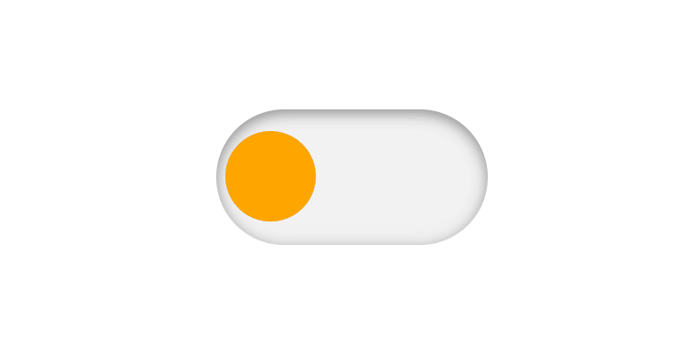

<h1 align="center"> 30 Days of CSS 🎨 </h1>

  
  <a href="#-main-goal">Main Goal</a>&nbsp;&nbsp;&nbsp;|&nbsp;&nbsp;&nbsp;
  <a href="#-rules">Rules</a>&nbsp;&nbsp;&nbsp;|&nbsp;&nbsp;&nbsp;
  <a href="#-challenges">Challenges</a>&nbsp;&nbsp;&nbsp;|&nbsp;&nbsp;&nbsp;
  <a href="#-bonus-content">Bonus Content</a>&nbsp;&nbsp;&nbsp;|&nbsp;&nbsp;&nbsp;
  <a href="#-license">License</a>&nbsp;&nbsp;&nbsp;|&nbsp;&nbsp;&nbsp;
  <a href="#-contributing">Contributing</a>&nbsp;&nbsp;&nbsp;|&nbsp;&nbsp;&nbsp;
  <a href="#support">Support</a> 

 

## 🖥 Main goal

- Improve coding skills by making mini daily projects using HTML5 and CSS.
- Project created by [Milena Carecho - 30 dias De CSS](https://github.com/MilenaCarecho/30diasDeCSS).

 

## 📢 Rules

- Create a Project per Day.
- Share your progress using the hashtags #30DaysOfCSS and #30diasDeCSS;
- The project must be completed by 11:59 pm.

 

## 📝 Challenges

 

- [Day 01 - Animation using search box](#id01)
- [Day 02 - Animated loader](#id02)
- [Day 03 - Layered social media icon](#id03)
- [Day 04 - Color changing checkbox](#id04)
- [Day 05 - Floating text](#id05)
- [Day 06 - Heart beating](#id06)
- [Day 07 - Shiny button](#id07)
- [Day 08 - Animated screen](#id08)
- [Day 09 - Animation with hover images](#id09)
- [Day 10 - Animated Checkbox Neon effect](#id10)
- [Day 11 - Pulsing effect](#id11)
- [Day 12 - Typewriter](#id12)
- [Day 13 - Text color change when entering another div](#id13)
- [Day 14 - Rotating card animation](#id14)
- [Day 15 - Shiny text](#id15)
- [Day 16 - Lightsaber](#id16)
- [Day 17 - Animated menu](#id17)
- [Day 18 - Smoky Text](#id18)
- [Day 19 - Background that changes color](#id19)
- [Day 20 - Fill effect when hovering](#id20)
- [Day 21 - Animated text background with stars](#id21)
- [Day 22 - Colorful animation](#id22)
- [Day 23 - Animation with text](#id23)
- [Day 24 - Image Slideshow](#id24)
- [Day 25 - Button with effect](#id25)
- [Day 26 - Animated circles](#id26)
- [Day 27 - Circles with effects](#id27)
- [Day 28 - Page Background Animation](#id28)
- [Day 29 - Effect with heart](#id29)
- [Day 30 - Fireworks](#id30)

 

## 👀 Did someone say Bonus content?

 

- [Day 31 - ](#id31)

 

## :writing_hand: Let's Get Started!

 

## Day 01 

- [LinkedIn](https://www.linkedin.com/feed/update/urn:li:activity:7280221392946552833/)
- [Instagram](https://www.instagram.com/p/DEXSHyiRxXxLXNteWtpG0cE3512OUCdK48Anc00/)
- [Code](https://github.com/Chrysthy/30DaysOfCSS/tree/main/challenges/day-01)

 

## Day 02 

- [LinkedIn](https://www.linkedin.com/feed/update/urn:li:activity:7280740906423513089/)
- [Instagram](https://www.instagram.com/p/DEXStPoxKct9Ugk7thekPzZSLcj2e5j4P_Dkus0/)
- [Code](https://github.com/Chrysthy/30DaysOfCSS/tree/main/challenges/day-2)

 

## Day 03 

- [LinkedIn](https://www.linkedin.com/feed/update/urn:li:activity:7280936017170157568/)
- [Instagram](https://www.instagram.com/p/DEXXyWtRf640CPZQ6H42X56M9Ka1Xyqr1QFF7E0/)
- [Code](https://github.com/Chrysthy/30DaysOfCSS/tree/main/challenges/day-03)

 

## Day 04 

- [LinkedIn](https://www.linkedin.com/feed/update/urn:li:activity:7281487777840459777/)
- [Instagram](https://www.instagram.com/p/DEgACXoRQnJBKuxrnRl6-UqV-4UK7tnOUH5U4w0/)
- [Code](https://github.com/Chrysthy/30DaysOfCSS/tree/main/challenges/day-04)

 

## Day 05 

- [LinkedIn](https://www.linkedin.com/feed/update/urn:li:activity:7281840325789184000/)
- [Instagram](https://www.instagram.com/p/DEgAEsuRk8M41ZqNiD8Ru4dUfYXOfHXHGf06Ro0/)
- [Code](https://github.com/Chrysthy/30DaysOfCSS/tree/main/challenges/day-05)

 

## Day 06 

- [LinkedIn](https://www.linkedin.com/feed/update/urn:li:share:7282143982887849984/)
- [Instagram](https://www.instagram.com/p/DEgAGmtxe5G3S4yiUCMPMBIO6oTDAjfkiH6aHo0/)
- [Code](https://github.com/Chrysthy/30DaysOfCSS/tree/main/challenges/day-06)

 

## Day 07 

- [LinkedIn]()
- [Instagram]()
   

## Day 08 

- [LinkedIn]()
- [Instagram]()

 

## Day 09 

- [LinkedIn]()
- [Instagram]()

 

## Day 10 

- [LinkedIn]()
- [Instagram]()

 

## Day 11 

- [LinkedIn]()
- [Instagram]()

 

## Day 12 

- [LinkedIn]()
- [Instagram]()

 

## Day 13 

- [LinkedIn]()
- [Instagram]()

 

## Day 14 

- [LinkedIn]()
- [Instagram]()

 

## Day 15 

- [LinkedIn]()
- [Instagram]()

 

## Day 16 

- [LinkedIn]()
- [Instagram]()

 

## Day 17 

- [LinkedIn]()
- [Instagram]()

 

## Day 18 

- [LinkedIn]()
- [Instagram]()

 

## Day 19 

- [LinkedIn]()
- [Instagram]()

 

## Day 20 

- [LinkedIn]()
- [Instagram]()

 

## Day 21 

- [LinkedIn]()
- [Instagram]()

 

## Day 22 

- [LinkedIn]()
- [Instagram]()

 

## Day 23 

- [LinkedIn]()
- [Instagram]()

 
  
## Day 24 

- [LinkedIn]()
- [Instagram]()

 
  
## Day 25 

- [LinkedIn]()
- [Instagram]()

 
  
## Day 26 

- [LinkedIn]()
- [Instagram]()

 
  
## Day 27 

- [LinkedIn]()
- [Instagram]()

 

## Day 28 

- [LinkedIn]()
- [Instagram]()

 
  
## Day 29 

- [LinkedIn]()
- [Instagram]()

 

## Day 30 

- [LinkedIn]()
- [Instagram]()

 

## ✨ Bonus content

 

## Day 31 

- [LinkedIn]()
- [Instagram]()

 

## 📜 License

- This project is licensed under the [MIT License](https://choosealicense.com/licenses/mit/)

 

## 🫱🏻‍🫲🏻 Contributing

 Contributions, issues, and feature requests are welcome! Please, feel free to do it! 😉 

 

## 🌟 Support

 If you like this project, please give it a star ⭐ and share it with others! 😄 

